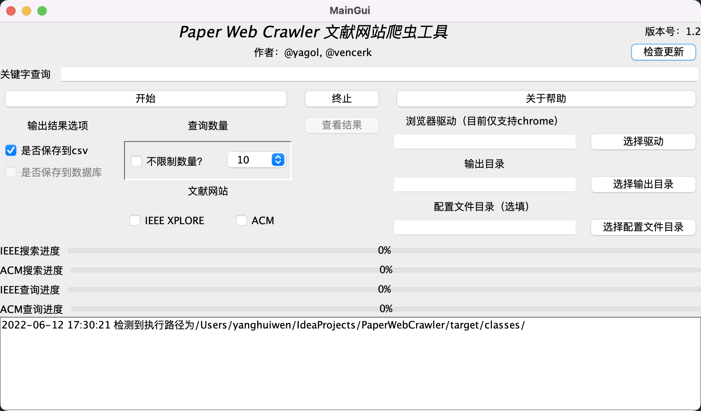
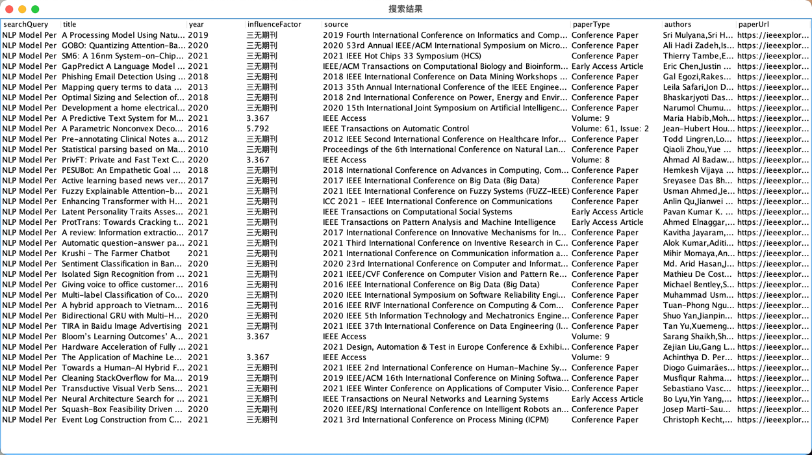
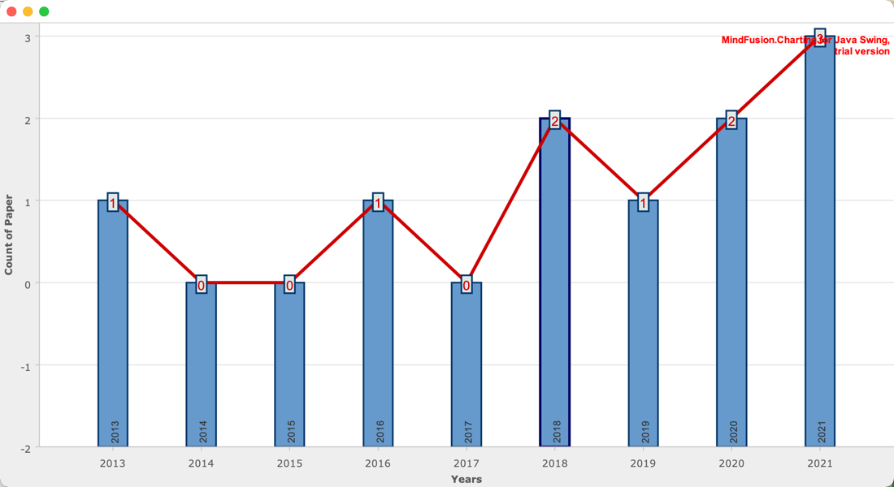

# 文献网站爬虫工具

还在为IEEE复杂的搜索条件发愁么？还在为ACM不支持自定义查询而苦恼么？那就试试这个小工具吧

## 开发文档及项目说明

本项目的开发文档及项目说明可查看[链接](https://yagol2020.github.io/project/pwc.html)

### 使用说明

1. 从releases中下载最新的exe文件和jre压缩包（该jre是java runtime环境，用于提供运行环境）
2. 将exe和解压后的jar文件夹放到同一个目录下（英文目录） 请确定目录结构如下

```tree
your folder name 
├── jre
│ ├── bin
│ └── lib
└── PWC.exe
```

3. 预先准备ChromeDriver（链接在下面）
4. 打开exe，即可开始运行

## 开发-准备工作

* Chrome浏览器
* **ChromeDriver: [链接](http://chromedriver.storage.googleapis.com/index.html)**

```markdown
极其重要！！！！！！

一定要将合适的ChromeDriver放到src/main/resources里，替换掉原有的ChromeDriver!
```

驱动的版本应与Chrome的版本一致，下图将展示如何查看Chrome版本


## 使用说明 Usage

1. 根据pom.xml配置依赖
2. GUI级别的工具入口是`gui.view.MainGui.main`
3. 输入想要查询的关键字



4. 文献的结果会输出在`target/classes/output/IEEE XPLORE YourSerarchQuery.csv`中，GUI级别的会弹出结果展示表格



5. 目前文献的信息包括
    1. 你查询的关键字
    2. 文章标题
    3. 作者列表
    4. 出处（期刊或会议名称）
    5. 发表日期
    6. 论文类型（期刊或会议）
    7. 对于期刊，可以获得影响因子
    8. paper的网页地址
    9. 论文数量统计，以折线图的形式

## 文献查询结果 Csv Result

文献查询结果会以`csv`文件形式呈现，如下图所示，该样例以`NLP Model Parameter`作为关键字进行查询。


## 折线图



## 近期目标 TODO List

| 序号        | 内容    |  开工时间  |    完工时间     | 提出人 |                   开发                   |
| :--------:   | :-----   | :----: |:-----------:|-----|:--------------------------------------:|
| 1        | IEEE XPLORE 爬虫框架      |   2021年11月10日    | 2021年11月12日 |     | @[yagol](https://github.com/yagol2020) |
| 2        | 论文等级识别      |   2021年11月12日    | 2021年11月22日 |     | @[yagol](https://github.com/yagol2020) |
| 2        | 论文等级识别      |   2021年11月12日    | 2021年11月22日 |     | @[yagol](https://github.com/yagol2020) |
| 3        | ACM 爬虫框架      |   2021年11月20日    | 2021年11月22日 |     | @[yagol](https://github.com/yagol2020) |
| 4        | IEEE XPLORE 摘要获取      |   2021年11月13日    |      -      |  @[vencerk](https://github.com/vencerk)   | @[yagol](https://github.com/yagol2020) |
|5         | ACM 爬虫框架 | 2022年1月1日| 2022年1月13日  |     | @[yagol](https://github.com/yagol2020) |
|6         | 柱状图 | 2021年12月20日| 2022年1月13日  |     | @[yagol](https://github.com/yagol2020) |
|7         | 饼状图 | 2022年1月5日| 2022年1月30日  |     | @[yagol](https://github.com/yagol2020) |
|8         | Springer 爬虫框架 | 2022年1月13日|      -      |     | @[yagol](https://github.com/yagol2020) |

## 仓库

[GitHub仓库链接](https://github.com/yagol2020/PaperWebCrawler)

[Gitee仓库链接](https://gitee.com/yagol2020/PaperWebCrawler)

* Gitee不定期与GitHub同步，还请以**GitHub**仓库为准

## IDEA's {File and Code Templates}

```java
/**
 * @author your name
 * @date ${TIME}
 * @Description the description of this class
 **/
class YourCode {

}
```

## 发行说明

由于本软件依赖于GitHub的releases功能实现自动更新功能，因此releases需要符合特定的规则

* EXE版发行的模版：标题为`PWC_EXE_x.x`，标签为`exe_x.x`。其中，`x.x`是版本号，其中包含一个`PWC.exe`可执行文件。
* JAR版发行的模板：`PWC_x.x`
