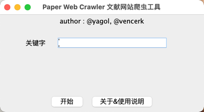

# 文献网站爬虫工具

**本文档可能落后与版本，最新的文档请查看`README.md`**

还在为IEEE复杂的搜索条件发愁么？还在为ACM不支持自定义查询而苦恼么？那就试试这个小工具吧

## 准备工作

* Chrome浏览器
* ChromeDriver: [链接](http://chromedriver.storage.googleapis.com/index.html)

驱动的版本应与Chrome的版本一致，下图将展示如何查看Chrome版本


## 使用说明 Usage

1. 根据pom.xml配置依赖
2. 控制台级别的工具入口是App.main，GUI级别的工具入口是`gui.view.MainGui.main`
3. 输入想要查询的关键字

```java
public class App {
    public static void main(String[] args) {
        IeeeSearchQuery ieeeSearchQuery = new IeeeSearchQuery("put your search query in there");
        IeeeResultProcessor processor = new IeeeResultProcessor();
        processor.run(ieeeSearchQuery);
    }
}
```



4. 文献的结果会输出在`target/classes/output/IEEE XPLORE YourSerarchQuery.csv`中，GUI级别的会弹出结果展示表格


5. 目前文献的信息包括
	1. 你查询的关键字
	2. 文章标题
	3. 作者列表
	4. 出处（期刊或会议名称）
	5. 发表日期
	6. 论文类型（期刊或会议）
	7. 对于期刊，能够获得影响因子

## 文献查询结果 Csv Result

文献查询结果会以`csv`文件形式呈现，如下图所示，该样例以`NLP Model Parameter`作为关键字进行查询。


## 近期目标 TODO List

| 序号        | 内容    |  开工时间  |  完工时间  |
| :--------:   | :-----   | :----: | :----: |
| 1        | IEEE XPLORE爬虫框架      |   2021年11月10日    |   2021年11月12日    |
| 2        | 论文等级识别      |   2021年11月12日    |   -    |
| 3        | ACM爬虫框架      |   -    |   -    |

